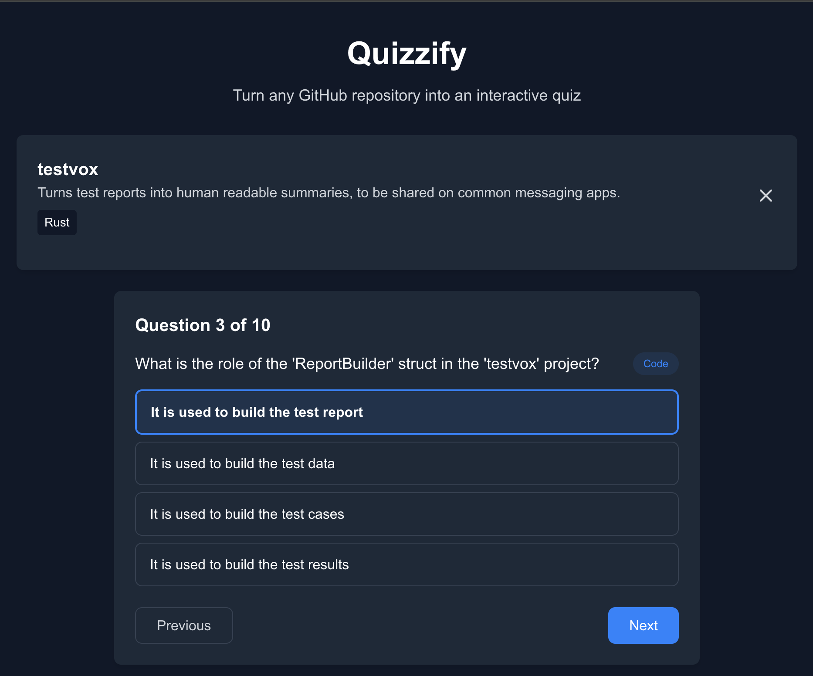

# Quizzify 🧠



Turn any GitHub repository into an interactive quiz to test your knowledge and learn more about the codebase.

## 📝 About This Project

This project was **entirely implemented using [Cursor](https://cursor.sh)**, the AI-powered code editor, as a **Proof of Concept (PoC)** to evaluate the IDE's capabilities for rapid application development. 

### Key Points:
- **No manual coding**: All code was generated and implemented through Cursor's AI assistance
- **No tests included**: As this is a PoC focused on development speed and AI capabilities, comprehensive testing was not prioritized
- **Rapid development**: The entire application was built from scratch in a short timeframe
- **AI-first approach**: Demonstrates how AI can accelerate full-stack development

This serves as a demonstration of Cursor's ability to understand complex requirements, generate appropriate code, and maintain consistency across a full application stack.

## 🚀 Features

- **GitHub Repository Integration**: Input any GitHub repository URL to generate a quiz
- **AI-Powered Quiz Generation**: Dynamic quiz creation using OpenAI GPT-4
- **Categorized Questions**: Questions organized into Domain (60%), Code (30%), and General (10%) categories
- **Interactive Quiz Experience**: Multiple choice questions with explanations
- **Progress Tracking**: Visual progress bar and question navigation
- **Responsive Design**: Works seamlessly on desktop and mobile devices
- **Real-time Feedback**: Immediate feedback on answers with explanations
- **Score Tracking**: Final score display with percentage calculation
- **Smart Fallbacks**: Graceful degradation when APIs are unavailable

See [ROADMAP.md](ROADMAP.md) for development plans and future features.

## 🚀 Running the Project

1. **Clone the repository**
   ```bash
   git clone https://github.com/yourusername/quizzify.git
   cd quizzify
   ```

2. **Install dependencies**
   ```bash
   npm install
   ```

3. **Set up environment variables**
   Create a `.env.local` file in the project root:
   ```bash
   QUIZZIFY_OPENAI_API_KEY=your_openai_api_key_here
   QUIZZIFY_GITHUB_TOKEN=your_github_token_here
   ```

4. **Run the development server**
   ```bash
   npm run dev
   ```

5. **Open your browser**
   Navigate to [http://localhost:3000](http://localhost:3000)

## 🎯 Usage

1. **Enter a GitHub URL**: Paste any GitHub repository URL in the input field
2. **Generate Quiz**: Click "Generate Quiz" to create AI-powered questions based on the repository
3. **Take the Quiz**: Answer 10 categorized multiple choice questions about the repository
4. **Review Results**: See your score and explanations for each question
